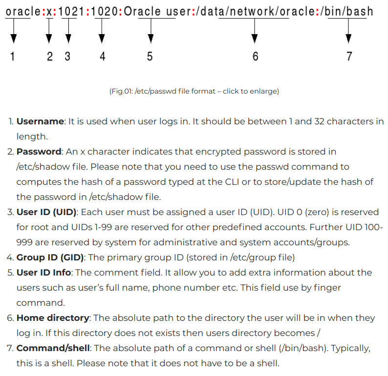
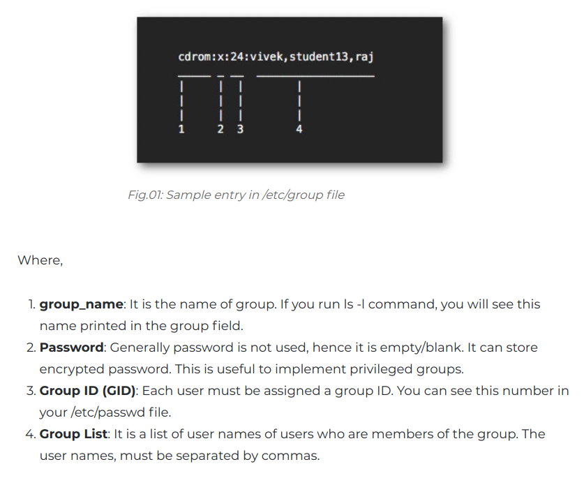

Steps on remote machine
1. create user 'developer' ```sudo adduser developer```
2. add user 'developer' to sudoers ```usermod -aG sudo developer```
3. switch to new user ```sudo su developer```
4. generate (public, private) key pair ```ssh-keygen -t rsa```
5. add the contents of your public key file (id_rsa.pub) to a new line in your ~/.ssh/authorized_keys ```cat ~/.ssh/id_rsa.pub >> ~/.ssh/authorized_keys```
6. 

## create user 'developer' for ssh access sudo adduser developer

When user is created by adduser also group with same name is added. 
You can inspect users by listing **/etc/passwd** file
For example, the line of **/etc/passwd** for the root user may look like this:

```root:x:0:0:root:/root:/bin/bash```

These fields contain the following information, in the following order, separated by a colon character:

1. Username
2. Password (shown as x if encrypted)
3. User ID number (UID)
4. Group ID number (GID)
5. Comment field (used by the finger command)
6. Home Directory
7. Shell



## add user 'developer' to sudoers ```usermod -aG sudo developer```

This will update record in **/etc/groups** file that holds group. With command ```groups developer``` You can see to which groups user developer belongs


##  generate (public, private) key pair ```ssh-keygen -t rsa```
You will be prompted to supply a filename (for saving the key pair) and a password (for protecting your private key). If you don't password-protect your private key, anyone with access to your computer conceivably can SSH (without being prompted for a password) to your account on any remote system that has the corresponding public key.